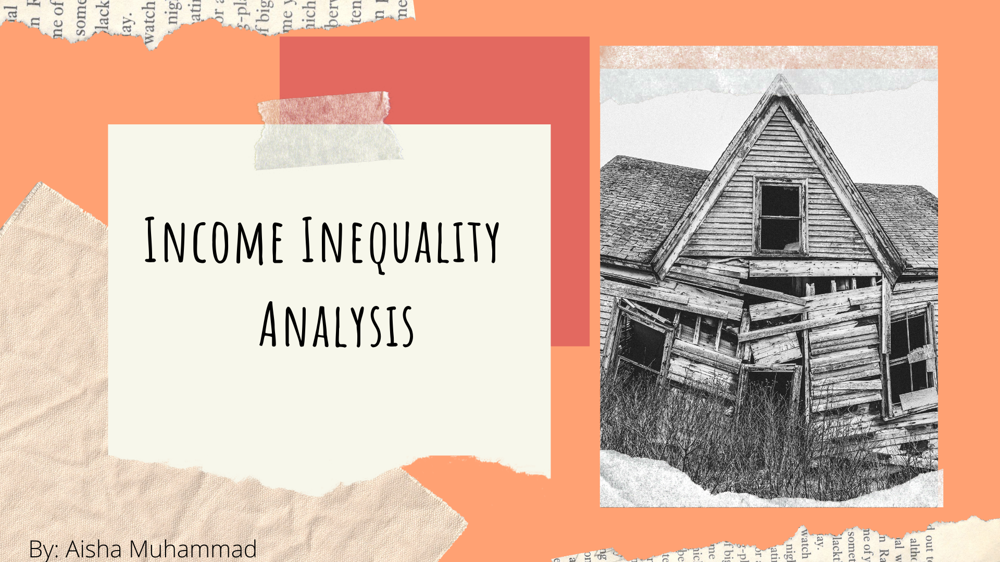

# Income-Inequality-Analysis

I've always been intrigued about bettering the world. So, in this project I decided to collect data from the WHO on wealth inequality and indentify contirbuting factors. This data set was created from a xls export and then converted in to a CSV with over 195 countries and over 2000 specific regions total. 

The current csv file with over 2000 rows is located here. Finally, I will conduct my analysis using both Excel and Python. 

